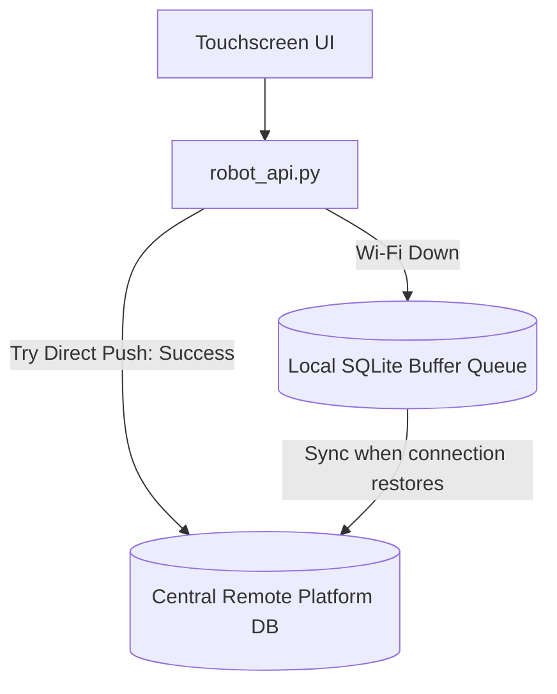

```mermaid
flowchart TD
    UI["Touchscreen UI"] --> API["robot_api.py"]
    
    API -->|Try Direct Push: Success| DB[("Central Remote Platform DB")]
    API -->|Wi-Fi Down| QUEUE[("Local SQLite Buffer Queue")]
    
    QUEUE -->|Sync when connection restores| DB
```
