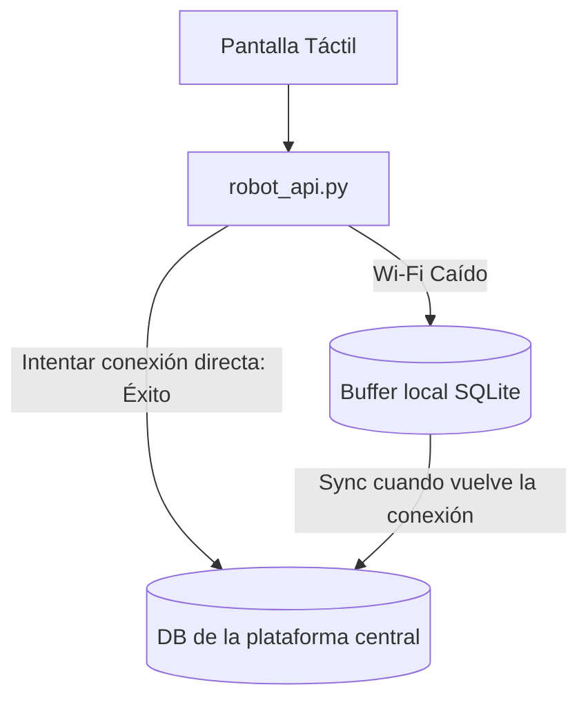

```mermaid
flowchart TD
    UI["Pantalla Táctil"] --> API["robot_api.py"]
    
    API -->|Intentar conexión directa: Éxito| DB[("DB de la plataforma central")]
    API -->|Wi-Fi Caído| QUEUE[("Buffer local SQLite")]
    
    QUEUE -->|Sync cuando vuelve la conexión| DB
```
